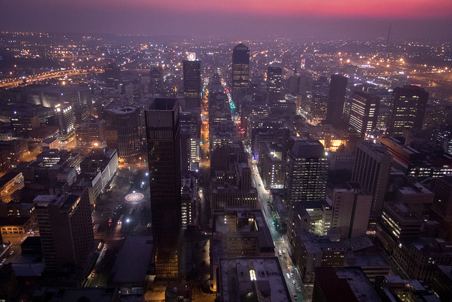

# PyNeuralArt

## Introduction

This fork contains a Caffe-based implementation of [A Neural Algorithm of Artistic Style](http://arxiv.org/abs/1508.06576), which presents a method for transferring the artistic style of one input image onto another.

Different from the original master, this fork removes unnecessary code and dependencies while still preserving the core and idea of the algorithm. 

In my version, the nertwork operations are handled by Caffe, while loss minimization and other miscellaneous matrix operations are performed using numpy and scipy. L-BFGS is adopted for optimization.

To run the code, first set the correct model in the demo.py, e.g. GoogLeNet, VGG16, VGG19 or simply CaffeNet and put the corresponding pretrained caffemodel in the folder so that the program could correctly find it. Then

```bash
python demo.py -s <style-image> -c <content-image>
```

You are also encouraged to read the `style.py` which is the core of the algorithm.

## Requirements

* Caffe and PyCaffe
* Numpy
* Scipy
* OpenCV

## Examples

The style image is the Starry Night:


The content image is a photo of Johannesburg:



The result is Starry Johannesburg:


## References

The original paper could be found [here](http://arxiv.org/abs/1508.06576).

The master of the repository resides [here](https://github.com/fzliu/style-transfer).